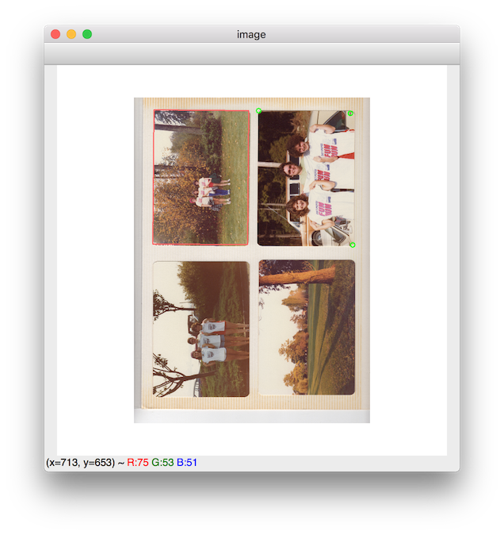

Tools for simplifying the process of scanning photo albums with minimal effort.

## Scanning

Download the scanline command from here https://github.com/klep/scanline and
add to your `PATH`

Use this script which will prompt to press enter for each scanned page and 
automatically number the output.

Note: Will scan to the current directory, so `cd` into an appropriate directory
and run the script from there.

[Link to scan.sh](scan.sh)

```
#!/bin/bash

if [[ -z $BOOK ]]; then
  echo -n "Book: "
  read -r BOOK
  BOOK=$(printf '%02d' "$BOOK")
fi

if [[ -z $PAGE ]]; then
  echo -n "Starting Page: "
  read -r PAGE
fi

while true; do
  NAME="book${BOOK}_page$(printf '%03d' ${PAGE})"
  echo "Scanning page $NAME"
  scanline -a4 -flatbed -dir "$(pwd)" -resolution 600 -jpeg -name $NAME
  PAGE=$(($PAGE + 1))

  echo -n " == Enter to start page $PAGE: "
  read
done
```

Example output:

```
$ ../scan.sh
Book: 8
Starting Page: 39
Scanning page book08_page039
Starting scan...
Done
 == Enter to start page 40:
Scanning page book08_page040
Starting scan...
Done
 == Enter to start page 41:
Scanning page book08_page041
Starting scan...
...
```

## Splitting

The scan step takes full `a4` sized scans of your flatbed. The next step is to split those scans up into individual photos.

There are automatic tools that can do this task [example split.sh](split.sh), but I've found it difficult to get it 100%, especially when scanning photos without removing them from the album page so there isn't a perfect white background.

Instead here is a custom tool written in Python with OpenCV to do the splitting
with some manual assistance. It offers automatically detected crops for approval, but if incorrect they can be done manually.

[Link to split.py](split.py)

### Usage:

`cd` into the directory where output files should be placed

Run `split.py` and pass all scanned images to split as arguments

```
../split.py ../scans/*.jpg
```

An OpenCV window will open.

1. Red rectangles will outline each automatically detected crop. If these are already correct, skip to 8
2. Press `backspace` to remove any incorrect automatic crops (or edit the python script to make it detect better for your thresholds)
3. Click each of the 4 corners of the photo to place a marker there
4. On the last corner, hold down the mouse to visualize the cropping rectangle
5. The rectangle will be the smallest possible rectangle which contains all of the points (your markers might not be perfectly at the corners, but they will be contained)
6. When the photo is ready, press `spacebar` to finalize that photo
7. Repeat 3-6 on the next photo until all are set
8. When all photos are ready. Press `enter` to save the photos to disk and load the next photo

Auto-crop Controls:

- `w` to increase auto-crop threshold (and retry auto-crop)
- `s` to decrease auto-crop threshold
- `d` to increase auto-crop blurring
- `a` to decrease auto-crop blurring
- `v` to cycle available view modes
- `c` to cycle cropping channels

Other controls:

- `backspace` to undo the last marker or cropping rectange
- `b` to go back to previous photo
- `n` to go to the next photo
- `q` or `esc` to quit


